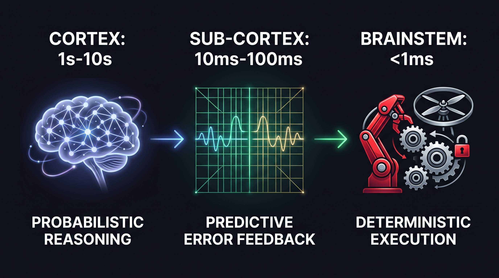

# perceptual-chain

> **Type-Safe Sub-Cortex Protocol for Aligning LLM Reasoning with Deterministic Execution**

[](https://opensource.org/licenses/MIT)
[](https://www.python.org/downloads/)
[](https://docs.pydantic.dev/)
[]()

---

 **Read the Full Paper**: This repository serves as the official canonical reference implementation for the upcoming Medium / Towards Data Science article: **"Perceptual Chain: Sub-Cortex Protocol for Type-Safe and Deterministic LLM Execution"** *(Publication link coming soon)*.

 **Safety & Security Notice**: For countermeasures against autonomous agent misuse, threat models, and defensive containment protocols, please consult our **[Safety & Defensive Architecture Guidelines](docs/SAFETY_GUIDE.md)**.

---

## Abstract & Core Philosophy

Modern Embodied AI and autonomous agent frameworks suffer from a fundamental structural void (**The Architectural Void**).

The high-level reasoning layer (**Cortex / LLM**) is inherently **probabilistic**, prone to hallucinations and un-converged reasoning outputs. Conversely, real-world execution environments—such as robotics, core financial operations, and drone dynamics (**Brainstem**)—demand sub-millisecond **deterministic safety boundaries**.

Directly coupling probabilistic reasoning to physical actuation risks catastrophic system hardware failure or unrecoverable state corruption.

`perceptual-chain` provides the missing **Type-Safe Sub-Cortex Protocol**. It validates and normalizes unstructured Cortex commands via Pydantic Strict Validation, passes payload parameters through deterministic Finite State Machine (FSM) safety interlocks, and continuously feeds residual sensory errors back to the Cortex via a **Predictive Error Feedback Loop** for autonomous trajectory re-planning.

---

## Key Capabilities & Use Cases

By integrating `perceptual-chain`, engineers can immediately enforce strict safety boundaries and autonomous recovery cycles between LLM agents and physical/critical execution substrates:

* **Hallucination & Anomaly Interlocking**: Physical command blockage of over-budget financial transactions or over-spec movement via Pydantic Validation and Brainstem FSM gates.
* **Kinetic Energy Dissipation (Aiki-Damping)**: Dynamic trajectory smoothing and velocity damping when angular velocity limits are breached, preventing dynamic hardware crashes.
* **Autonomous Emergency Recovery (E-Stop)**: Instant FSM lockdown to safe hovering modes upon detecting sensor noise, telemetry spikes, or lost telemetry keys.
* **Predictive Residual Error Feedback**: Real-time vector difference calculation passed back to the Cortex to trigger iterative LLM trajectory re-planning.

### Killer Use-Case Examples (`examples/`)

1. **[`01_robotics_arm_control.py`](examples/01_robotics_arm_control.py)**
   * **Domain**: Robotics / Embodied AI
   * **Scenario**: Intercepts over-spec velocity requests from an LLM Cortex, applies physical boundary enforcement alongside 'Aiki-Damping' energy dissipation, and passes residual trajectory errors back to Cortex for re-planning.
2. **[`02_financial_agent_guard.py`](examples/02_financial_agent_guard.py)**
   * **Domain**: Autonomous Financial Agents
   * **Scenario**: Intercepts hallucinated single-batch transfer requests (e.g., 80% capital transfer), triggers immediate Brainstem FSM lockouts, and returns structured threshold errors.
3. **[`03_drone_emergency_recovery.py`](examples/03_drone_emergency_recovery.py)**
   * **Domain**: Drones / Edge Actuation
   * **Scenario**: Detects telemetry loss or sensor noise during flight, forces the Brainstem state machine into `EMERGENCY_STOP`, and initiates fail-safe hardware hovering.

---

## Architecture (3-Layer Separation & Timescales)

The protocol mirrors biological nervous system dynamics across three distinct execution layers and timescales:


*Figure 1: Functional flow and execution timescales across Cortex (Probabilistic Reasoning), Sub-Cortex (Type-Safe Validation Bridge), and Brainstem (Deterministic Safety Interlocks).*

---

## Quick Start (Minimal Working Example)

Below is a minimal working example demonstrating how Sub-Cortex type validation links with Brainstem hard boundary checks:

```python
from perceptual_chain import (
    Brainstem,
    SafetyBoundary,
    SubCortexBridge,
    PredictiveErrorLoop,
)

# 1. Define deterministic physical limits (e.g., joint angular velocity limits)
boundary = SafetyBoundary(
    min_limits={"velocity": -2.0},
    max_limits={"velocity": 2.0},
)

# 2. Initialize layers
brainstem = Brainstem(safety_boundary=boundary)
bridge = SubCortexBridge(min_confidence_threshold=0.85)
loop = PredictiveErrorLoop(bridge=bridge, brainstem=brainstem, error_tolerance=0.05)

# 3. Simulated LLM Output payload
raw_llm_output = {
    "action_name": "set_motor_speed",
    "parameters": {"velocity": 1.5},  # Safe Int-to-Float coercion enabled
    "confidence": 0.92,
}

# State predicted by Cortex
predicted_state = {"velocity": 1.5}

# 4. Mock Hardware Executor
def mock_hardware_executor(action_name, parameters):
    return {"status": "SUCCESS"}, {"velocity": 1.48}

# 5. Step through Predictive Error Feedback Loop
result = loop.step(
    raw_llm_output=raw_llm_output,
    predicted_state=predicted_state,
    executor=mock_hardware_executor,
)

print(f"Execution Allowed: {result.success}")
print(f"Residual Error Vector: {result.error_vector}")
```

---

## Testing

The repository provides a complete test suite powered by `pytest` to guarantee schema boundary rules and FSM state transition invariants:

```bash
# Install development dependencies
pip install -e .[dev]

# Run full test suite
pytest tests/
```

---

## Intellectual Property & Disclaimer Notice

This program is an open-source byproduct of the advanced profile optimization research mentioned in the documentation; those core features and underlying optimization algorithms are explicitly excluded from this repository and implemented separately.

```text
# Copyright (c) 2026 PastToFuture-Whisperer
# SPDX-License-Identifier: MIT
#
# This program is a byproduct of the advanced profile optimization research 
# mentioned in the documentation; those core features and underlying optimization 
# algorithms are explicitly excluded from this repository and implemented separately.
```

---

## Ecosystem

*Additional core tools and infrastructure optimization repositories within the PastToFuture-Whisperer ecosystem will be linked here upon release.*

---

## Sponsors & Acknowledgments

We extend our gratitude to our community and GitHub Sponsors for supporting this research. Your sponsorship helps accelerate the safe integration of autonomous AI with deterministic physical execution.